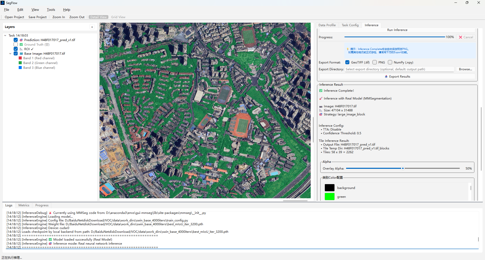

<p align="center">
  
</p>

<p align="center">
  <a href="https://www.python.org/"></a>
  <a href="https://doc.qt.io/qtforpython-6/"></a>
  <a href="https://docs.opencv.org/4.x/"></a>
  <a href="https://rasterio.readthedocs.io/"></a>
  <a href="https://gdal.org/"></a>
</p>

<p align="center">
  <a href="https://pytorch.org/docs/stable/"></a>
  <a href="https://mmcv.readthedocs.io/"></a>
  <a href="https://mmsegmentation.readthedocs.io/"></a>
  <a href="docs/ENVIRONMENT_REQUIREMENTS.md"></a>
  <a href="https://github.com/xicheng79/segflow/releases"></a>
  <a href="LICENSE"></a>
</p>

<p align="center">
  <strong>English</strong> | <a href="README_zh-CN.md">简体中文</a>
</p>

# SegFlow

A graphical workspace for remote-sensing semantic segmentation. It provides an integrated visual workflow for dataset management, sample analysis, configuration generation, model training, model evaluation, project-state restoration, and large-image inference, powered by [OpenMMLab / MMSegmentation](https://github.com/open-mmlab/mmsegmentation).

<p align="center">
  
</p>

---

## 1.Key Features

- **Dataset Management**: Import VOC-style datasets, browse samples, lazily load thumbnails, and resplit datasets
- **Sample Analysis**: Class-distribution statistics, coverage analysis, metadata inspection, and dataset health checks
- **Visualization Canvas**: `rasterio`-based GeoTIFF pyramid/LOD loading, multiband display, and pseudocolor mask overlays
- **Training Configuration**: Visual hyperparameter editing, Advisor recommendations, pretrained-weight selection, and one-click MMSeg config generation
- **Model Training**: Run training through a selected conda environment, parse logs in real time, plot loss/metric curves, save checkpoints, and preview live predictions
- **Model Testing**: Evaluate trained checkpoints through the MMSegmentation test runner and display overall and per-class metrics
- **Project Files**: Save and reopen dataset, model, inference, task configuration, UI state, and generated custom-module paths with `.rsgproj` files
- **Large-Image Inference**: GDAL-based block and sliding-window inference for large remote-sensing images, with progress reported through Qt signals

---

## 2.Two-Layer Environment Design (Important)

> SegFlow intentionally separates its dependencies into **two independent environments**. Please understand this design before installation.

| Layer | Purpose | Installation | Required |
|------|------|---------|---------|
| **Layer A: GUI Host Environment** | Runs the desktop application, dataset tools, visualization, and config generation | `pip install -r requirements.txt` | Yes |
| **Layer B: Training/Runtime Environment** | Provides PyTorch, MMEngine, MMCV, and MMSegmentation for training, model testing, and real inference | Separate conda environment (`environment_train.yml`) | Required for training, testing, and real inference |

The two layers communicate through **isolated subprocesses**. The GUI does not require the training framework to be installed in its own environment. Select a configured runtime Python interpreter in the **Environment Configuration** panel to use it for training, testing, and inference.

Generated modules such as `custom_rs_dataset.py` and `custom_live_pred_hook.py` are recorded in the project file and loaded explicitly from their file paths during testing and inference.

For a detailed dependency analysis, see [Environment Requirements](docs/ENVIRONMENT_REQUIREMENTS.md).

---

## 3.Quick Installation

### Option 1: Installation Script (Recommended)

**Windows:**
```bat
install.bat
```

**Linux / macOS:**
```bash
chmod +x install.sh
./install.sh
```

The scripts install the GUI dependencies, create the conda training/runtime environment defined by `environment_train.yml`, and install GPU-enabled PyTorch, MMCV, and MMSegmentation. CUDA and torch tags can be specified explicitly (defaults: `cu118` / `torch2.1`):

```bat
REM Windows: use CUDA 12.1
install.bat cu121 torch2.1
```
```bash
# Linux / macOS: use CUDA 12.1
./install.sh cu121 torch2.1
```

> ⚠️ The training/runtime environment requires an NVIDIA driver compatible with the selected CUDA build.

### Option 2: Manual Installation

```bash
# Layer A: GUI host environment
pip install -r requirements.txt

# Layer B: training/testing/inference environment
conda env create -f environment_train.yml
conda activate gui-mmseg
# Install a GPU-enabled PyTorch build (CUDA 11.8 example)
pip install torch torchvision --index-url https://download.pytorch.org/whl/cu118
# Install the matching MMCV build
pip install mmcv==2.1.0 -f https://download.openmmlab.com/mmcv/dist/cu118/torch2.1/index.html
# Install MMEngine and MMSegmentation
pip install mmengine "mmsegmentation>=1.0.0,<2.0.0"
```

> Replace `cu118` / `torch2.1` with versions compatible with your system and PyTorch build.

---

## 4.Launch

```bash
python main.py
```

Dataset management and visualization are available after startup. Before training, model testing, or real inference, select and validate the runtime Python interpreter in the **Environment Configuration** panel.

Use **File > Save Project** to create an `.rsgproj` file and **File > Open Project** to restore the saved dataset, model, custom modules, task settings, inference settings, and last active tab.

---

## 5.Test Dataset

- [SegFlow Sample Dataset (Baidu Netdisk)](https://pan.baidu.com/s/19oimOyu0l7Ouc2WHPwEaFQ) (extraction code: `wpur`) — a ready-to-use dataset for validating dataset import, sample browsing, data analysis, and the model training and evaluation workflow.

---

## 6.Documentation
- [Software User Manual](docs/Software_User_Manual.md) — installation, dataset preparation, model training, inference, and troubleshooting
- [Environment Requirements](docs/ENVIRONMENT_REQUIREMENTS.md) — dependency layers, installation requirements, and compatibility notes

---

## 7.Contact us
- Most development discussion happens on GitHub. Feel free to [open an issue](https://github.com/xicheng79/segflow/issues) or comment on any open issue or pull request.
- For project discussions and questions, please use [GitHub Discussions](https://github.com/xicheng79/segflow/discussions).
---

## License

SegFlow is licensed under the
[GNU General Public License v3.0 or later](LICENSE).
