

  <strong>English</strong> | <a href="Software_User_Manual_zh-CN.md">简体中文</a>

# SegFlow Remote Sensing Image Segmentation System User Manual

## 1 Software Introduction

### 1.1 Software Overview

SegFlow is a graphical workstation for semantic segmentation of remote sensing images. It provides one-stop visual operations for dataset management, sample analysis, configuration generation, model training, and large-image inference. The backend is integrated with the OpenMMLab/MMSegmentation framework.

### 1.2 Main Core Functions

**Dataset management:** VOC-structured dataset import, sample browsing, lazy loading of thumbnails, and dataset re-splitting.

**Sample analysis:** class distribution statistics, coverage analysis, and health checks.

**Visualization canvas:** rasterio-based hierarchical loading of large GeoTIFF images (pyramid/LOD), multi-band display, and pseudo-color mask overlay.

**Training configuration:** graphical hyperparameter configuration, intelligent recommendations from the configuration Advisor, and one-click generation of MMSeg configurations.

**Model training**: training is executed in an isolated conda environment; logs are parsed in real time; loss/metric curves are plotted; and prediction previews are displayed in real time.

**Large-image inference:** GDAL-based tiled sliding-window inference for ultra-large remote sensing images, with progress fed back to the progress bar in real time through Qt Signal.

### 1.3 Target Users

Remote sensing image processing personnel, deep learning model training personnel, GIS analysts, and related users.

## 2 Installation and Startup

### 2.1 System and Hardware Requirements:

**Operating system:** Windows/Linux/macOS

**Recommended hardware:** an NVIDIA discrete GPU (RTX 3060 or above is recommended, with at least 6 GB of VRAM).

**Prerequisite software:** Miniconda or Anaconda must be installed in advance and added to the system environment variables.

For details, see Appendix 1: SegFlow Runtime Environment Requirements Analysis.

### 2.2 Environment Installation

**Method 1: One-click installation script (recommended)**

**Windows:**

install.bat

**Linux / macOS:**

chmod +x install.sh

./install.sh

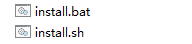

After a short waiting period, the script automatically installs the GUI host dependencies, creates the conda training environment gui-mmseg, and installs the GPU version of PyTorch + MMCV + MMSegmentation in that environment.

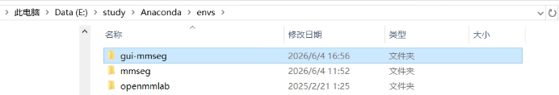

The training/inference environment is a GPU environment. An NVIDIA driver compatible with the target CUDA version must be installed in advance.

**Miniconda / Anaconda is required and must be configured in the system environment variables.**

**Method 2: Manual installation**

Layer A: GUI host environment (required)

pip install -r requirements.txt

\# Layer B: training/inference GPU environment (for training/actual inference)

conda env create -f environment_train.yml

conda activate gui-mmseg

\# Install GPU-enabled PyTorch according to the local CUDA version (example: CUDA 11.8)

pip install torch torchvision --index-url https://download.pytorch.org/whl/cu118

\# Install the matching MMCV

pip install mmcv==2.1.0 -f https://download.openmmlab.com/mmcv/dist/cu118/torch2.1/index.html

\# Install MMEngine and MMSegmentation

pip install mmengine "mmsegmentation>=1.0.0,<2.0.0"

Replace cu118/torch2.1 with the version that matches the local driver.

**Software startup:**

Use the standard terminal startup commands:

conda activate gui-mmseg

python main.py

After startup, all data management and visualization functions are available. For training or actual model inference, first select the Python interpreter of the gui-mmseg environment in the Environment Configuration panel.

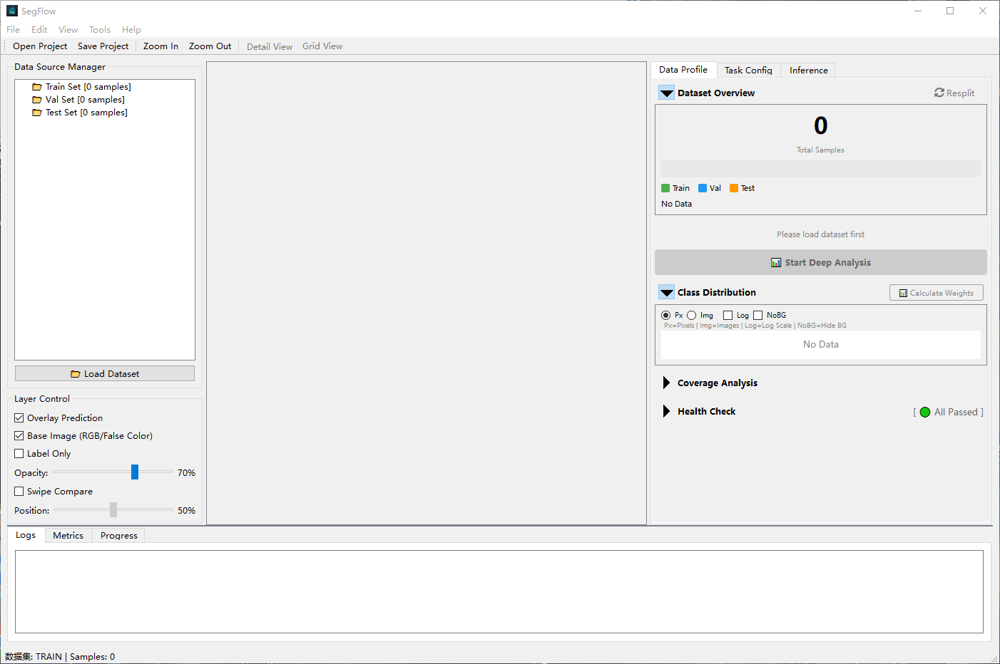

## 3 Detailed Operations for Core Functions

This chapter describes the core functional operations of the software. Common functions include:

| **Menu** | **Function**                                             |
|----------|----------------------------------------------------------|
| File     | Open, Save, Exit                                         |
| View     | Zoom In, Zoom Out, Fit to Window, Detail View, Grid View |
| Tools    | Training, Inference                                      |
| Help     | About the Software                                       |

### 3.1 Data Preparation

On the Data Profile page, click Load Dataset on the left and select the dataset root directory. The software automatically detects the dataset structure. After successful detection, the dataset can be loaded, and the numbers of training, validation, and test samples are displayed on the left.

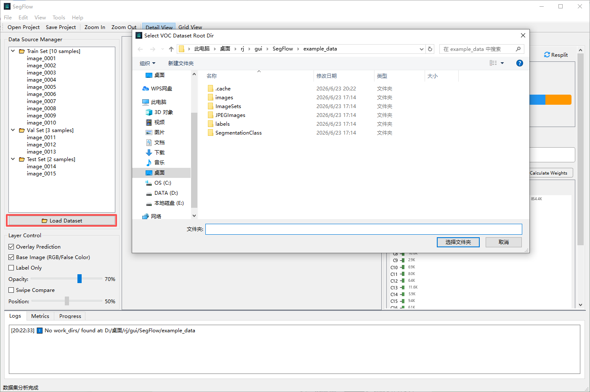

The software uses the standard PASCAL VOC dataset structure. Make sure that your directory strictly follows the format below to avoid loading failures caused by spelling errors:

Data/ (dataset root directory)

ImageSets/ -> stores the train.txt, val.txt, and test.txt split files

JPEGImages/ -> stores the original image files (note: the spelling must be JPEGImages)

SegmentationClass/ -> stores the corresponding label files (PNG format)

The label files should be single-channel PNG masks, where pixel values indicate class IDs. For example, 0 indicates the background, 1 indicates the target class, and 255 can be used as the ignore label. The original image filenames and label filenames should correspond one-to-one.

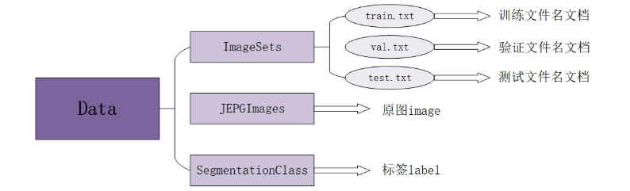

After loading the dataset, you can also click the Resplit button in the upper-right corner to customize the dataset split again.

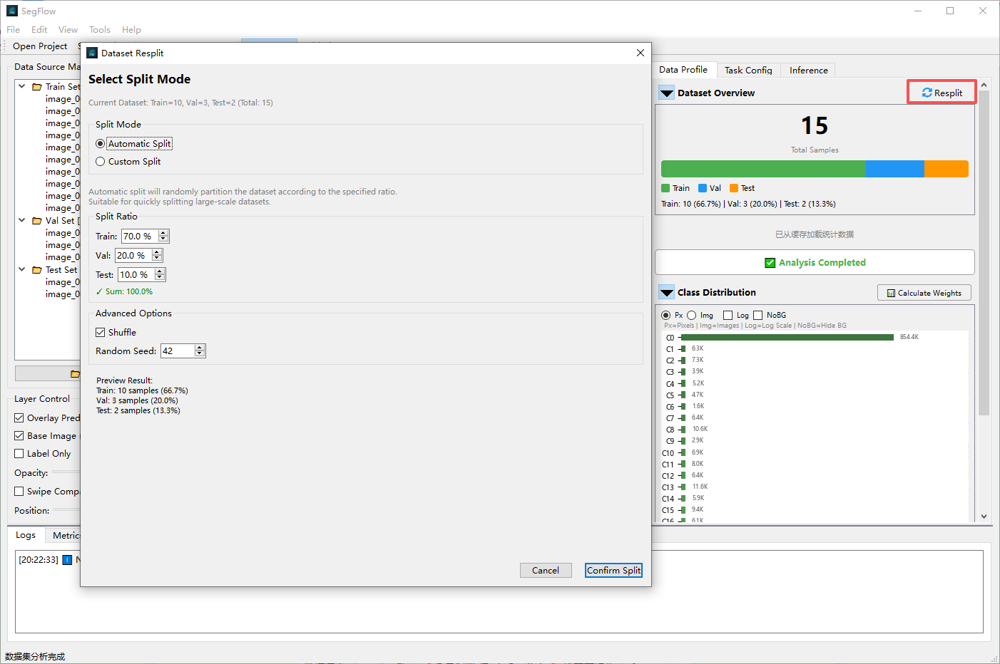

### 3.2 Model Configuration and Training

On the Task Config page, select the model algorithm framework to be trained, training weights, and related settings.

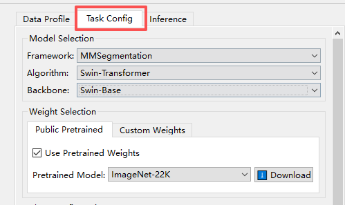

The software recommends training hyperparameters based on dataset statistics. You can adjust the parameters according to training requirements. Note that the selected suffix must be the same as the suffix of the image and label files in the dataset.

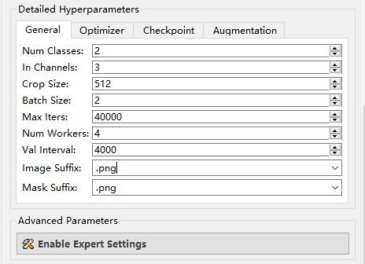

The software supports data augmentation strategies such as horizontal flipping, photometric distortion, random rotation, and multi-scale augmentation. Additional augmentations are automatically recommended by ConfigAdvisor.

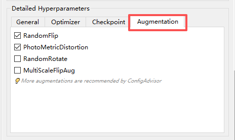

Advanced Parameters are provided for advanced users who need to modify the underlying MMSeg configuration.

In the Environment Readiness section, select the Python interpreter for the training environment, refresh the Conda environment, re-check the environment, and detect packages such as torch, mmcv, and mmseg. Training cannot start until the environment check passes.

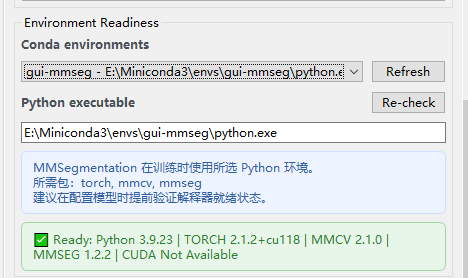

After model selection and parameter configuration are completed, click Run. After confirming the training configuration, click Start Training. The software generates the training configuration file and starts training.

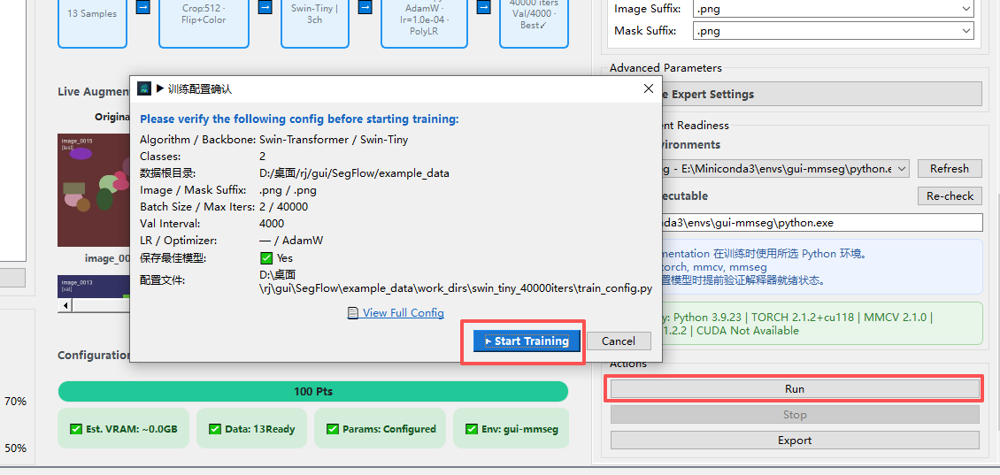

After training starts successfully, the Live Training Center displays training metrics, including loss, mIoU, and mAcc curves, as well as changes in validation metrics. Training progress is displayed in real time in the lower-left corner.

The log output area displays configuration generation information, the working directory, the current iteration number, loss, learning rate, validation metrics, error messages, and other information.

After training starts, the software creates a work_dirs folder under the dataset directory. Output files are automatically named and generated according to the selected backbone and the number of training iterations.

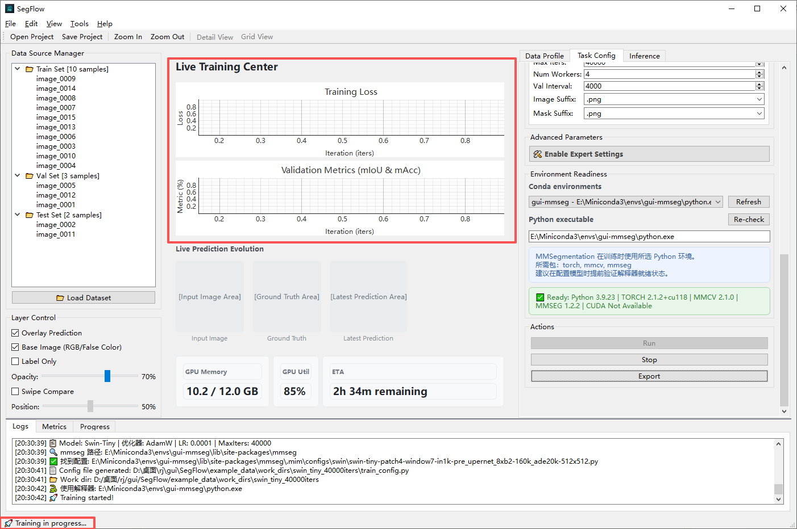

During training, you can click Stop in the Action Buttons area at any time to stop training. The software sends a termination request to the training process, and saved model files are not deleted automatically.

After training is completed, click Export to save the generated train_config.py to a specified location. Click Newly Trained Model -> Send to Inference Analysis; the software automatically switches to the inference page and fills in the configuration file and weight file.

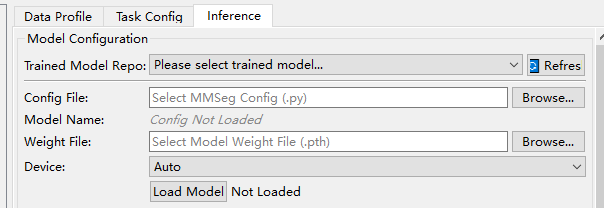

### 3.3 Model Inference and Result Export

#### 3.3.1 Model Loading

On the Inference page, load a trained model in the model loading area. Currently, models can be loaded in two ways:

**Method 1: Select from the trained model library. This option is available after the previous workflow has been completed.**

After the dataset is loaded, the software scans work_dirs.

Select a historical training model from the Trained Model Library.

The software automatically fills in the configuration file and weight file.

**Method 2: Specify manually.**

Select the MMSeg configuration file (.py).

Select the model weight file (.pth or .pt).

Select the computing device: Auto, CUDA:0, or CPU.

Click Load Model.

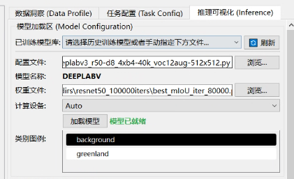

#### 3.3.2 Input Image Selection

Select the image to be inferred. The supported formats are png, jpg, jpeg, tif, tiff, and bmp. After selection, the image can be synchronized to the GIS basemap display.

#### 3.3.3 Inference Settings

Select the required inference strategy. The default strategy is large-image tiling.

| **Inference Strategy**   | **Applicable Scenario**                                                 |
|--------------------------|-------------------------------------------------------------------------|
| Large-image tiling       | Ultra-large remote sensing images; recommended for large GeoTIFF images |
| Full-image resizing      | Small images; quick preview                                             |
| Sliding-window inference | Medium-sized images; standard inference                                 |

Then configure inference parameters, including the inference window size, sliding-window stride, overlap ratio for large-image tiling, inference batch size, multi-scale flip augmentation, confidence threshold, and other settings.

After the settings are completed, click Run Inference to start inference. The inference progress is displayed below the button. You can click Cancel at any time to cancel inference; generated intermediate files may need to be checked manually by the user.

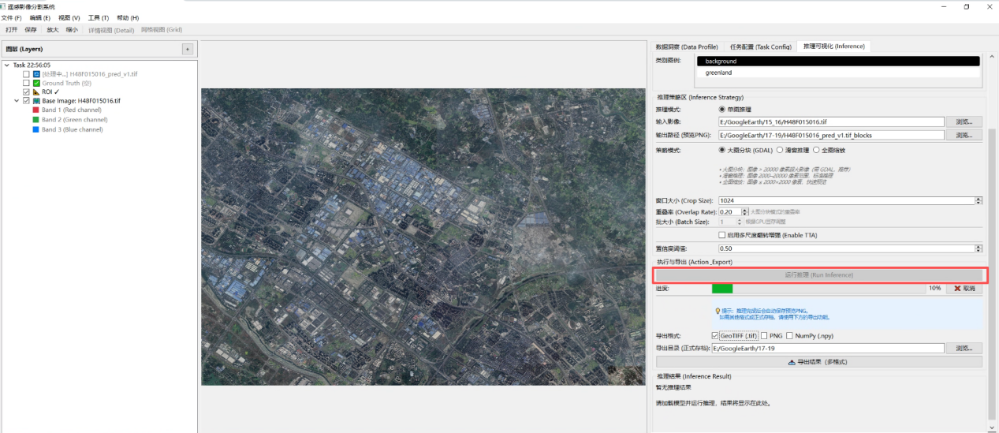

#### 3.3.4 Inference Result Display and Export

The inference results are displayed in the result area. Prediction layers can be overlaid onto the GIS canvas. Class colors and prediction-result transparency can be adjusted, and the color configuration can be applied to the preview.

Preview image: used for quick viewing and saved as PNG.

Class mask: saves class-ID results, such as 0/1/2/3.

GeoTIFF result: if the input is a GeoTIFF, the original CRS, affine transform, and resolution can be retained.

Visualization overlay: overlays the prediction mask onto the original image using class colors.

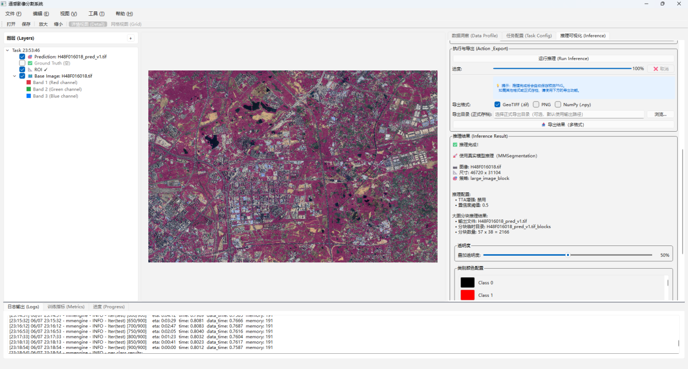

## 4 Frequently Asked Questions

| **Issue**                        | **Possible Cause**                                                                              | **Solution**                                       |
|----------------------------------|-------------------------------------------------------------------------------------------------|----------------------------------------------------|
| Dataset loading failed           | The directory structure does not meet the requirements                                          | Check JPEGImages, SegmentationClass, and ImageSets |
| Incorrect number of classes      | Label pixel values are inconsistent with the configured number of classes                       | Check label values and num_classes                 |
| Environment check failed         | torch/mmcv/mmseg is not installed or the versions do not match                                  | Re-check the conda environment                     |
| CUDA unavailable                 | The driver does not match the PyTorch CUDA version                                              | Install matching versions                          |
| Insufficient training GPU memory | The batch size or crop size is too large                                                        | Reduce the batch size/crop size                    |
| Inference result misalignment    | Tile coordinates or georeferencing information for large-image tiling was not written correctly | Check the output GeoTIFF transform                 |
| mIoU is not displayed            | The validation set is empty or log parsing failed                                               | Check val.txt and the log format                   |

# Appendix 1 SegFlow Runtime Environment Requirements Analysis

## 1.1 GUI Host Environment Dependency List

### 1.1.1 Strictly Required Dependencies (missing packages prevent startup)

| **Package Name**    | **Purpose**                                                       | **Referenced Location**                                      |
|---------------------|-------------------------------------------------------------------|--------------------------------------------------------------|
| PySide6             | Entire GUI framework; all widgets, signals, and threads           | Entire project                                               |
| numpy               | Image array operations, mask calculation, and sample statistics   | smart_canvas, mask_renderer, inference_engine, skills/, etc. |
| opencv-python (cv2) | Image reading/writing, resizing, and color-space conversion       | smart_canvas, mask_renderer, inference_engine                |
| Pillow (PIL)        | Large-image opening (Image.MAX_IMAGE_PIXELS) and PNG/JPEG reading | inference_engine                                             |
| matplotlib          | Class distribution charts and training-curve plotting             | class_distribution_widget, metrics_plot_widget               |
| jinja2              | Configuration-file template generation                            | core/logic_engine.py                                         |

### 1.1.2 Optional but Strongly Recommended Dependencies (functions degrade if missing)

| **Package Name** | **Purpose**                                                            | **Consequence if Missing**                                                                      |
|------------------|------------------------------------------------------------------------|-------------------------------------------------------------------------------------------------|
| rasterio         | GeoTIFF multi-band reading, image pyramid (LOD), and viewport cropping | The large-image canvas cannot read .tif files and falls back to OpenCV (single band/no pyramid) |

### 1.1.3 Standard Library (no installation required; included with Python)

os, sys, re, json, sqlite3, subprocess, multiprocessing, hashlib, math, csv, ast, copy, time, signal, datetime, pathlib, dataclasses, enum, typing, abc, collections

## 1.2 Training/Inference Environment Dependency List

### 1.2.1 Core Dependencies for Training Functions

| **Package Name** | **Version Constraint**      | **Purpose**                                        |
|------------------|-----------------------------|----------------------------------------------------|
| torch (PyTorch)  | >=2.0 recommended          | Foundation for model tensor computation            |
| mmengine         | >=0.7.0                    | OpenMMLab unified training engine                  |
| mmcv             | >=2.0.0                    | Low-level operator acceleration library            |
| mmsegmentation   | >=1.0.0, <2.0.0           | Semantic segmentation framework                    |
| CUDA Toolkit     | Matches the PyTorch version | GPU acceleration (required for training/inference) |

### 1.2.2 Extended Dependencies for Large-Image Inference

| **Package Name** | **Purpose**                                                                                                   | **Consequence if Missing**                 |
|------------------|---------------------------------------------------------------------------------------------------------------|--------------------------------------------|
| gdal (osgeo)     | Tiled reading of ultra-large remote sensing images and GeoTIFF writing (including georeferencing information) | Large-image tiled inference is unavailable |
